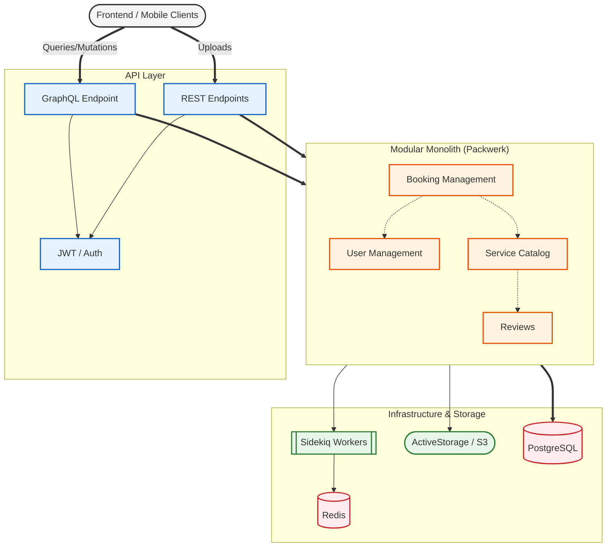

# Backend Architecture

The Jashnify Backend is built as a **Modular Monolith** using Ruby on Rails and the `packwerk` gem to enforce boundary separation.

## System Overview



## Component Breakdown

### 1. API Layer
- **GraphQL (`/graphql`)**: The primary interface for the frontend. Uses `graphql-ruby`.
- **REST (`/api/v1`)**: Used for specialized operations like file uploads, analytics, and health checks.

### 2. Packs (Business Logic)
Each pack is a self-contained module with its own models, services, and tests.
- **`user_management`**: Handles authentication, user profiles, and roles (Admin, Vendor, Customer).
- **`service_catalog`**: Manages photographer services, categories, and portfolios.
- **`booking_management`**: Core logic for availability slots, booking requests, and status transitions.
- **`reviews`**: Handles customer feedback and rating distribution.

### 3. Core Services
- **`JWTService`**: Handles token issuance and verification.
- **`AuthorizeApiRequest`**: Command pattern service for securing endpoints.
- **`VendorAnalyticsService`**: Aggregates data for vendor dashboards.

### 4. Infrastructure
- **PostgreSQL**: Primary relational database.
- **Redis**: Powering Sidekiq for background jobs (image processing, email notifications).
- **ActiveStorage**: Handles portfolio image uploads and processing via `libvips`.

## Enforced Boundaries
We use `packwerk` to ensure that packs do not have circular dependencies and only access each other's public APIs.

---

## Model & Domain Layer Design

### Principle: Lean Models, Rich Domain Services

**Models** focus on **data integrity only**:
- ✅ Basic validations (presence, format, length)
- ✅ Database constraints and relationships
- ✅ Simple query scopes
- ✅ Read-only helpers
- ❌ Complex business logic
- ❌ External calls
- ❌ State machines
- ❌ Authorization

**Domain Services** handle **business logic**:
- Workflow orchestration
- State transitions
- Dependency injection
- Testable in isolation (no Rails framework dependency)

**Query Objects** provide **single source of truth** for reusable queries:
- `BookingConflictsQuery` - Used in model scopes, domain services, and controllers
- `VendorAvailabilityQuery` - Prevents query duplication
- One change = works everywhere

### Example: Booking Lifecycle

```ruby
# Model: Lean
class Booking < ApplicationRecord
  validates :event_date, presence: true
  validate :event_date_in_future, on: :create

  scope :cancellable, -> { where(status: %i[pending accepted]).where('event_date > ?', 24.hours.from_now) }

  def can_be_cancelled?
    cancellable?  # Uses scope, not inline logic
  end
end

# Domain Service: Business Rules
class Bookings::Validate
  def call
    errors = []
    errors << validate_vendor_availability  # Uses query object
    errors << validate_no_conflicts          # Uses query object
  end
end

# State Machine: Single Source of Truth
class Bookings::StateMachine
  VALID_TRANSITIONS = {
    pending: %i[accepted declined],
    accepted: %i[completed cancelled],
    # ...
  }
end

# Controller: Thin
def create
  booking = @user.bookings.build(booking_params)
  errors = Bookings::Validate.call(booking: booking)

  if errors.empty?
    booking.save && render_success
  else
    render_errors(errors)
  end
end
```

### Layers Summary

| Layer | Responsibility | Example |
|-------|---|---|
| **Model** | Data + simple queries | `scope :cancellable` |
| **Query Object** | Complex queries (reusable) | `BookingConflictsQuery` |
| **Domain Service** | Business logic orchestration | `Bookings::Validate`, `Bookings::StateMachine` |
| **Controller Concern** | HTTP request/response only | `render_errors`, `authenticate_user!` |

### File Structure
```
app/
├── models/
│   ├── booking.rb                    # ~35 LOC (lean)
│   └── queries/
│       ├── booking_conflicts_query.rb
│       └── vendor_availability_query.rb
├── domain/
│   └── bookings/
│       ├── validate.rb               # Business validation
│       ├── state_machine.rb          # State rules
│       ├── authorize_access.rb       # Authorization
│       └── send_message.rb
└── controllers/concerns/
    └── booking_management/
        └── booking_actions.rb        # HTTP only
```
